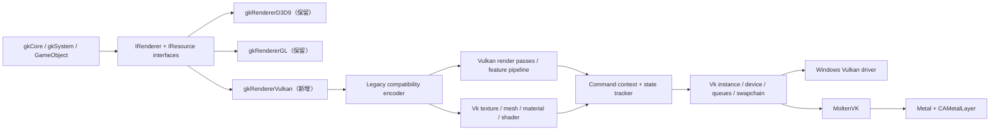
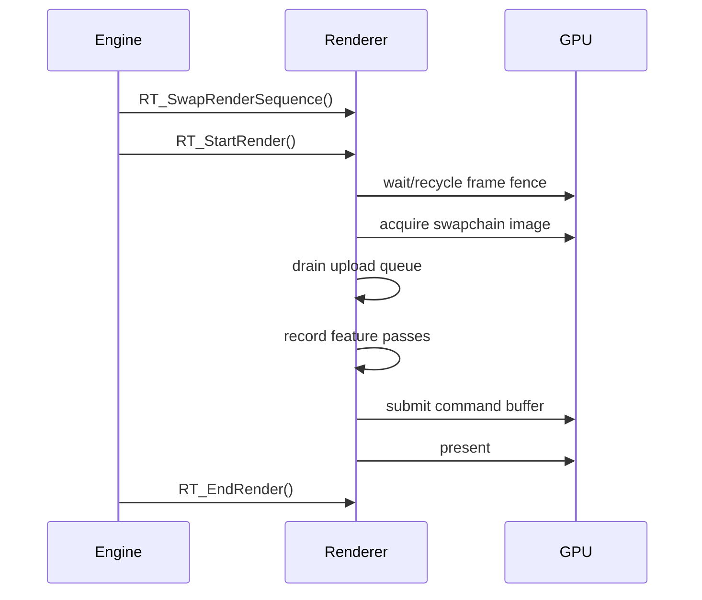

# gkVulkanRenderer 设计方案与开发计划

> 文档状态：Windows P0-P2 compatibility-forward 已实现；P3+ 与 macOS 待实现
> 编写日期：2026-07-28
> 目标平台：Windows（原生 Vulkan）与 macOS（Vulkan + MoltenVK），第一优先级为 Apple Silicon macOS
> 目标读者：后续接手实现的开发 Agent / 渲染开发者

## 1. 结论先行

### 1.1 2026-07-29 Windows 实现状态

Windows Vulkan 后端已推进至 P2 的 compatibility-forward 验收点：

- Vulkan 1.2 device/swapchain、dynamic rendering、synchronization2、双帧同步、
  resize/minimize/restore、Validation Layer 与磁盘 pipeline cache 已落地。
- 静态/动态 mesh、DDS/TGA/RAW、材质与 sub-material、16 个兼容纹理槽、
  alpha blend/test、depth/cull/double-side、render layer 与透明物体排序已接通。
- `.gfx` 会解析 render layer、macro mask 和 technique 名；P2 所需的
  `ksbase`、`kssimple`、`ks_skyhdr`、skinned、terrain、grass/vegetation
  均有 Vulkan 映射。当前 forward fallback 中不改变结果的旧宏共享 pipeline，
  `ALPHATEST` 使用独立 specialization pipeline。
- 离线 shader target 使用 `compile_vulkan_shaders.py`，包含递归 include
  依赖哈希、`spirv-val`、SPIRV-Cross reflection、descriptor/location 与
  vertex-fragment stage 接口校验，并输出稳定 manifest。
- skinned vertex layout 已支持 CPU bone-palette fallback（位置、tangent、
  binormal），terrain/vegetation 动态 triangle-list mesh 可提交；缺失可选
  terrain RAW 包时使用平坦高度和零植被密度的确定性降级。
- font/HUD/screen quad、screen line、3D line/grid/AABB/circle/gizmo 已实现。
- `gkVulkanSmoke` 的 resize/minimize/restore 与 indoor scene 均在 Validation
  Layer 下无 Vulkan error；D3D9 target 同时完成构建回归。

P2 场景验收有一个非 renderer 阻塞：当前 checkout 不含
`objects/characters/prophet/prophet.chr`，且 `gkSystem` 的 animation module
加载仍被禁用。因此 `TestCase_LoadCharacter` / `TestCase_CharacterAnimation`
可稳定进入但没有可供 renderer 验证的角色内容。恢复该媒体包与 animation
module 后，应补做最终动画视觉验收；renderer 的 skinning fallback 不依赖这项
外部恢复继续编译和运行。

推荐以一个全新的、与现有两个 renderer 并列的 `gkRendererVulkan` 模块扩展引擎：

- 保留 `gkRendererD3D9` 和 `gkRendererGL`，在 Vulkan 达到可替代状态前不改写、不删除它们。
- Vulkan 模块只使用 Vulkan API；macOS 上通过 MoltenVK 将 Vulkan 映射到 Metal，不在 renderer 内混用 OpenGL 或直接 Metal 渲染。
- 暂不引入覆盖全引擎的通用 RHI。现有 renderer 的资源、状态和渲染管线耦合很深，先做 RHI 会迫使 D3D9/GL 一起迁移，破坏面和验证成本都过大。
- 在 `gkRendererVulkan` 内部建立一层兼容编码器，把现有的 `IShader::FX_*`、`ITexture::Apply()`、render-target push/pop 和隐式 render state 转换为 Vulkan 的 pipeline、descriptor、dynamic uniform 和 command buffer 操作。
- shader 使用独立的 Vulkan GLSL 450 源码，离线编译为 SPIR-V；保留 `.gfx` 作为 shader、macro、technique 和 pipeline state 的元数据入口。不能把现有 D3D9 Effect 或 GLES2 shader 当作可直接、无损自动转换的输入。
- 第一版请求 Vulkan 1.2，要求 `VK_KHR_dynamic_rendering` 和 `VK_KHR_synchronization2`（在 Vulkan 1.3+ 使用对应 core 功能）。这能显著简化现有频繁 push/pop render target 的迁移。不要为了“新”而把 Vulkan 1.4 设为最低要求。
- macOS 必须正确处理 `VK_KHR_portability_enumeration`、`VK_KHR_portability_subset`、`VK_EXT_metal_surface` 和 `CAMetalLayer`。
- 先以单渲染线程完成正确性和 feature parity；现有 `r_MTRendering` 在后期恢复。Vulkan 对象生命周期、窗口事件与 swapchain 处理未稳定前，不应同时调试多线程。

该路线的核心是：**对引擎外部最小改动，对 Vulkan 模块内部采用正确的现代架构**。

## 2. 范围与非目标

### 2.1 本项目范围

- 新增 `gkRendererVulkan`，完整实现 `IRenderer`。
- 新增 Vulkan 版本的 texture、mesh、material、shader 资源及其 manager。
- 复用现有 render sequence、render layer、camera、material 文件和 mesh 文件所表达的语义。
- 尽可能恢复当前 D3D9 renderer 的渲染能力，并至少覆盖 GL renderer 在 macOS 上已有的能力。
- 支持窗口创建、swapchain、resize、最小化、全屏切换和 Retina framebuffer size。
- 支持 Windows 与 macOS 的构建、运行、validation 和 shader 工具链。
- 建立可重复、可缓存、可在 CI 中执行的 SPIR-V 离线编译流程。

### 2.2 明确非目标

- 第一阶段不删除或重构 `gkRendererD3D9` / `gkRendererGL`。
- 第一阶段不创建通用 D3D9/GL/Vulkan RHI。
- 第一阶段不支持 iOS、tvOS、visionOS；但平台层不能把未来扩展堵死。
- 不引入 ray tracing、mesh shader、bindless、Vulkan Video 等当前引擎没有的 feature。
- 不把旧 Oculus/D3D9 stereo 路径作为首发验收项。
- 不在生产运行时携带 shader compiler。
- 不以“能显示一个三角形”作为完成标准；最终验收必须覆盖现有测试场景和主要渲染 feature。

## 3. 仓库现状与设计依据

以下结论来自当前仓库，而非抽象假设。

### 3.1 模块与构建

| 项目 | 当前事实 | 对 Vulkan 的影响 |
|---|---|---|
| 公共接口 | `code/engine/gkCommon/IRenderer.h` 提供 renderer 边界 | 可以并列新增 backend |
| Windows | CMake 只构建并默认加载 `gkRendererD3D9` | 需要增加 DLL target 和配置分支 |
| macOS | CMake 把核心模块构建为 static lib，并固定链接 `gkRendererGL330` | Apple 构建必须在 GL 与 Vulkan 中二选一，不能同时静态链接含同名全局符号的两套实现 |
| 模块加载 | `gkSystem.cpp` 硬编码 D3D9/GLES2/GL330 的 load/unload 分支 | 只需增加一个小分支，但应由 CMake backend option 驱动 Apple 静态选择 |
| macOS 窗口 | 当前 GL330 使用仓库内 GLFW 3.2.1 创建 OpenGL 窗口 | Vulkan target 应使用支持现代 Cocoa Vulkan WSI 的独立、固定版本 GLFW，不能依赖旧 GL target 的构建产物 |
| 第三方 | `code/thirdparty` 本身是 submodule | Vulkan-Headers、VMA、SPIR-V reflection、GLFW、MoltenVK 应在 thirdparty 仓库中固定版本 |

### 3.2 公共接口并非完全 API-neutral

- `IRenderer` 使用 `HWND`；非 Windows 平台把它当作 `void*`。
- `IShader::FX_SetMatrixArray()` 暴露了前置声明的 `D3DXMATRIX*`。
- `IRenderer.h` 中的 profiling 宏直接写了 `D3DPERF_*`。
- `gkRenderOperation.h` 的 `gkVertexDecl` 默认仍是 D3D 类型。
- `ITexture` 使用 `onLost()` / `onReset()` 这组 D3D9 语义。

这些问题不值得在 Vulkan 首个 PR 中全面修正。推荐：

- `HWND` 在 Vulkan 平台继续作为 opaque native-window handle 使用。
- `gkShaderVK::FX_SetMatrixArray()` 保持原签名，但内部按 engine `Matrix44` 数据读取，不依赖 D3D 库。
- Vulkan 代码不展开 D3D profiling 宏，内部使用 `VK_EXT_debug_utils` label。
- 只在 `gkRenderOperation.h` 增加一个很小的 `RENDERER_VULKAN` 分支。
- Vulkan 的 `onLost()` / `onReset()` 定义为 swapchain-dependent resource 的失效与重建，不模拟 D3D device lost。

### 3.3 现有 renderer 能力差异

`gkRendererD3D9` 是 feature 参考实现，包含：

- 延迟光照、延迟着色及部分 forward 路径。
- 三层级联阴影、shadow mask、SSAO、SSRL、deferred fog。
- HDR、bloom、DOF、color grading、后处理抗锯齿。
- 反射图、cubemap、light probe、water 相关路径。
- skinned mesh、terrain、vegetation、HUD、font、aux renderer。
- GPU particle、GPU timer、backbuffer readback、动态分辨率。
- 独立渲染线程和 stereo 分支。

`gkRendererGL` 是更适合参考 Vulkan API-independent 逻辑的实现，但 feature 少于 D3D9：

- 已有 framebuffer、depth、normal、ambient/point light、shadow mask、fog、HDR/bloom/DOF、post AA。
- 只实际生成一个 shadow cascade。
- SSAO 代码被硬编码关闭。
- GPU particle、color grading、GPU profiler 等接口为空或不完整。

因此实现时：

- **资源加载、平台拆分和 GLSL 语义优先参考 GL renderer。**
- **feature 列表、渲染顺序和最终视觉优先参考 D3D9 renderer。**
- 不应直接复制某一套 renderer 并机械替换 API 调用。

### 3.4 Shader 资产规模

当前仓库有：

- 39 个 `.gfx` 模板。
- 37 个 D3D9 `.fx` 文件及 9 个公共 include。
- 10 个 GLES vertex shader、25 个 GLES fragment shader 和 5 个 include。
- 一部分 `.gfx` 以 `<GFX>` 为根，一部分直接以 `<GLES2Shader>` 为根；新工具必须兼容或先规范化这两种历史格式。

shader 迁移是本项目最大工作量和最大风险，不是设备初始化。

## 4. 最小破坏性架构



### 4.1 为什么不先做通用 RHI

现有代码的 renderer 不只是 device backend，还同时包含：

- window/context；
- resource manager 和资源文件解析；
- shader effect/technique；
- render sequence 和排序；
- feature pipeline；
- aux/font；
- render thread。

若现在抽象 RHI，会先把 D3D9 implicit state、GL implicit state、D3D Effect 和 Vulkan immutable pipeline 统一到一个尚未验证的接口，再同时回归三套 renderer。这个改动不是“扩展一个 renderer”，而是重写渲染架构。

推荐只在 `gkRendererVulkan` 内设计清晰的 Vulkan 子系统。待 Vulkan feature parity 完成后，再用单独项目抽取真正重复且已验证稳定的 API-neutral 代码，例如 render sequence 和 material XML parser。

### 4.2 允许改动的公共文件

首批公共改动应限制在以下范围：

1. `code/engine/gkCommon/IRenderer.h`
   - 在枚举末尾追加 `ERdAPI_VULKAN`，不得插入中间导致现有数值变化。
2. `code/engine/gkCommon/gkRenderOperation.h`
   - 增加 `RENDERER_VULKAN` 的 `gkVertexDecl` 定义；Vulkan 实际按 `vertexData->vertexType` 生成 vertex input。
3. `code/engine/gkSystem/source/gkSystem.cpp`
   - 增加动态/静态 module load/unload 分支。
4. `code/engine/gkSystem/source/gkSystemProfiler.cpp`
   - 增加 renderer 名称显示。
5. 根 `CMakeLists.txt` 及 macOS toolchain
   - 增加 backend option、target、依赖和 packaging。
6. `exec/tools/default_cfg/startup.cfg`
   - 增加可选 renderer 示例，不在 Vulkan 稳定前改 Windows 默认值。

除此之外的公共接口变更必须有独立理由和回归测试。

## 5. 建议目录结构

```text
code/engine/gkRendererVulkan/
├── include/
│   ├── gkRendererVulkan.h
│   ├── gkVkPrerequisites.h
│   ├── gkVkRenderSequence.h
│   ├── gkVkRenderLayer.h
│   └── gkVkShaderParamDataSource.h
├── source/
│   ├── dllmain.cpp
│   ├── gkRendererVulkan.cpp
│   ├── gkVkRenderSequence.cpp
│   ├── gkVkRenderLayer.cpp
│   ├── gkVkShaderParamDataSource.cpp
│   └── gkVkAuxRenderer.cpp
├── Vulkan/
│   ├── gkVkInstance.*
│   ├── gkVkDevice.*
│   ├── gkVkSwapchain.*
│   ├── gkVkFrameContext.*
│   ├── gkVkCommandContext.*
│   ├── gkVkImageStateTracker.*
│   ├── gkVkPipelineCache.*
│   ├── gkVkDescriptorAllocator.*
│   ├── gkVkUploadAllocator.*
│   ├── gkVkDeletionQueue.*
│   └── gkVkDebugUtils.*
├── Platform/
│   ├── Win32/gkVkRenderContextWin32.*
│   └── macOS/gkVkRenderContextMac.mm
├── RenderRes/
│   ├── gkVkTexture.*
│   ├── gkVkTextureManager.*
│   ├── gkVkMesh.*
│   ├── gkVkMeshManager.*
│   ├── gkVkMaterial.*
│   ├── gkVkMaterialManager.*
│   ├── gkVkShader.*
│   └── gkVkShaderManager.*
├── RenderSys/
│   ├── gkVkRenderPipeline.*
│   ├── gkVkShadowPass.*
│   ├── gkVkDeferredPasses.*
│   ├── gkVkPostProcessPasses.*
│   └── gkVkGpuParticleProxy.*
└── CVars/
    └── gkVkRendererCVars.*

exec/engine/shaders/vulkan/
├── source/
│   ├── include/
│   ├── material/
│   ├── deferred/
│   ├── shadow/
│   ├── post/
│   └── debug/
└── cache/                    # 生成物；本地忽略，打包/CI 生成

exec/tools/
├── compile_vulkan_shaders.py
└── validate_vulkan_shaders.py
```

除现有模块协议规定的入口符号外，所有新增实现类型使用 `gkVk*` 或 `gkRendererVulkan` 前缀，避免与 GL/D3D 的 `gkTextureManager`、`gkShaderManager` 等实现类型发生符号冲突。Apple static build 仍必须一次只链接一个 renderer backend，不能靠改入口名称规避这一约束。

## 6. Vulkan 平台与设备层

### 6.1 API 基线

推荐最低能力：

- Vulkan API 1.2。
- `VK_KHR_surface`。
- 平台 surface extension。
- `VK_KHR_swapchain`。
- `VK_KHR_dynamic_rendering`。
- `VK_KHR_synchronization2`。
- `samplerAnisotropy` 若设备支持则启用，否则有确定性降级。
- `timestampComputeAndGraphics` 只作为 profiler 可选能力。

Vulkan 1.3+ 上使用 core dynamic rendering / synchronization2；1.2 上使用 KHR entry point。封装层对上层提供同一组函数。

不要把 descriptor indexing、buffer device address、timeline semaphore 设为 MVP 必需项。它们对当前引擎 feature 没有必要，还会扩大 MoltenVK portability 风险。

### 6.2 Physical device 选择

设备选择必须打分并输出完整日志：

- 必须存在 graphics queue 和 present support。
- 优先 discrete GPU，但允许 integrated/Apple GPU。
- 验证 required extensions 和 required feature bits。
- 验证所需 texture/depth/render-target format。
- 输出 API version、vendor/device ID、driver、queue family、memory heap 和 portability feature。
- 支持 `r_vk_device_index` 强制选择，便于多 GPU 调试。
- 若无可用设备，返回可理解的初始化错误，不能只 `GK_ASSERT`。

### 6.3 macOS / MoltenVK 特例

macOS 初始化必须：

1. 启用 `VK_KHR_portability_enumeration`。
2. `VkInstanceCreateInfo::flags` 添加 `VK_INSTANCE_CREATE_ENUMERATE_PORTABILITY_BIT_KHR`。
3. 枚举到 portability device 时启用 `VK_KHR_portability_subset`。
4. 使用 `VK_EXT_metal_surface`；不要新写已废弃的 `VK_MVK_macos_surface` 路径。
5. surface 所依赖的 `CAMetalLayer` 必须正确挂到 Cocoa view，且 layer delegate 保持为对应 view。
6. resize 使用 framebuffer pixel size，不使用逻辑 window point size。
7. 窗口、event pump、Cocoa view/layer 变更在主线程执行；render command recording 可在后期移到渲染线程。

建议窗口层使用一份较新的、固定版本 GLFW，并以：

```cpp
glfwWindowHint(GLFW_CLIENT_API, GLFW_NO_API);
```

创建窗口，再通过 GLFW Vulkan WSI 创建 surface。若在实际验证中 GLFW 与现有 launcher/static link 冲突，则 macOS 平台文件直接获取 `NSView` 并创建 `CAMetalLayer` / `vkCreateMetalSurfaceEXT`；该差异必须封装在 `gkVkRenderContextMac.mm`，不能泄漏到 renderer 其他部分。

MoltenVK 链接建议分两种模式：

- 开发：Vulkan SDK loader + validation layers，便于标准验证。
- 发布：app bundle 内固定并签名的 MoltenVK XCFramework/dylib，避免要求用户安装 Vulkan SDK。

两种模式使用同一 Vulkan 代码路径。依赖版本必须固定在 thirdparty revision 或 lock 文件中，不得每次构建浮动下载“latest”。

### 6.4 Swapchain

- 默认 2 frames in flight。
- surface image count 取 `minImageCount + 1`，不超过 `maxImageCount`。
- present mode：
  - `r_vsync=1`：FIFO。
  - `r_vsync=0`：优先 MAILBOX，其次 IMMEDIATE，再退回 FIFO。
- swapchain format 要与现有手工 gamma 行为共同验证。首版优先 `_UNORM` 以避免旧 shader 已做 gamma 转换时发生二次转换；若平台只给 sRGB format，则 final-output shader 必须补偿。
- `VK_ERROR_OUT_OF_DATE_KHR`、`VK_SUBOPTIMAL_KHR`、窗口 resize 只标记重建，在安全帧边界执行。
- framebuffer extent 为 0（最小化）时暂停 acquire/render/present，不 busy-loop，不反复重建。
- 重建 swapchain 时只重建 swapchain-dependent images、views 和 size-dependent render targets，不重建 device、mesh 或普通 texture。

### 6.5 Frame context 与同步

每个 frame context 至少包含：

- command pool / primary command buffer；
- image-acquired semaphore；
- render-finished semaphore；
- frame fence；
- transient descriptor pool；
- dynamic uniform/upload ring 的 frame slice；
- 延迟销毁队列；
- timestamp query range。

帧流程：



禁止每帧调用 `vkDeviceWaitIdle()`。它只允许出现在最终 Destroy、不可恢复错误处理和早期调试断言中。

## 7. 兼容编码器：最小改动的关键

现有代码使用“设置状态，然后 draw”的即时模型：

1. `IShader::FX_Set*()` 写参数。
2. `ITexture::Apply(channel, filter)` 绑定纹理槽。
3. `FX_Begin/BeginPass()` 选择 technique/pass。
4. render state 随时改变。
5. `_render(gkRenderOperation)` 发 draw。

Vulkan pipeline 和 descriptor 是显式对象，不能逐行翻译。新模块应维护一个 `gkVkLegacyState`：

```text
current shader + variant + technique + pass
current scalar/matrix parameter staging bytes
current texture[16] + sampler mode[16]
current raster/depth/stencil/blend/color-write state
current color/depth attachments and formats
current vertex input type + topology
```

在 `_render()` 时：

1. 根据 attachment format、shader、variant、technique/pass、vertex layout 和 render state 生成 `PipelineKey`。
2. 从 pipeline cache 获取或懒创建 `VkPipeline`。
3. 把当前参数 staging block 复制到 per-frame dynamic uniform ring。
4. 分配或复用 descriptor set，写入 dynamic UBO 和当前 texture/sampler。
5. 绑定 VB/IB、pipeline、descriptor、viewport/scissor。
6. 调用 `vkCmdDraw*`。

这样上层 renderable、material 和绝大多数 render sequence 调用不必改变。

### 7.1 `IShader` 兼容语义

| 旧接口 | Vulkan 实现 |
|---|---|
| `FX_SetValue/Float/Vector/Matrix` | 按反射得到的 offset/size 写 CPU staging block |
| `FX_SetMatrixArray` | 按 array/matrix stride 打包 bone matrices |
| `FX_GetTechniqueByName` | 返回稳定 interned name handle |
| `FX_GetTechnique` | 把 `EShaderInternalTechnique` 映射到 `.gfx` Vulkan technique |
| `FX_SetTechnique` | 更新 current technique |
| `FX_Begin` | 返回 technique 的 pass 数，不立刻创建 command |
| `FX_BeginPass` | 选择 pass 和其 pipeline-state template |
| `FX_Commit` | 标记参数/descriptor dirty；实际 upload 在 draw 时完成 |
| `FX_EndPass/FX_End` | 结束兼容作用域并执行 debug 校验 |
| `switchSystemMacro` | 选择或加载 `{materialMask, systemMask}` SPIR-V variant |
| `onLost/onReset` | shader module 通常不变；清理与 attachment format 相关的 pipeline cache entry |

参数不存在时应忽略并只记录一次 debug warning，保持与 GL uniform location `-1` 类似的容错行为；type/size 不匹配必须在 validation build 报错。

### 7.2 Uniform 布局

Vulkan GLSL 不允许像 GLES shader 那样把普通非 opaque uniform 散落在 block 外。首版使用一个兼容参数 block：

```glsl
layout(std140, set = 0, binding = 0) uniform GKParams {
    // 由每个 shader 明确定义，字段名继续沿用 g_mWorld、g_camPos 等
} gk;
```

texture stage 使用固定 combined-image-sampler bindings，例如 set 0 的 binding 1..16 对应 legacy channel 0..15。

注意：

- `Vec3` 在 std140 中通常占 16-byte 对齐槽，不能用 `memcpy(12 bytes)` 推导下一个字段位置。
- matrix 和 matrix array 必须遵循反射得到的 `matrixStride` / `arrayStride`。
- `gkVkPackMatrix()` 是唯一 CPU → shader matrix 打包入口；禁止在各 pass 内散落 transpose。
- shader build/validation 工具必须验证 vertex/fragment 对共享 block 的 layout 完全一致。
- skin palette 可先放在同一 UBO（56 个 matrix 仍在 Vulkan 最低 UBO range 内），稳定后再拆到独立 dynamic UBO/SSBO。

### 7.3 Render state 与 pipeline cache

新增 typed state，而不是把 D3D9 常量传进 Vulkan：

```text
depthTest, depthWrite, depthCompare
cullMode, frontFace, polygonMode
blendEnable + src/dst/op
colorWriteMask
stencil enable/compare/op/ref/mask
primitive topology
sampleCount
```

`PipelineKey` 必须包含：

```text
shader variant hash
technique/pass
vertex input type
primitive topology
color attachment count/formats
depth/stencil format
sample count
raster/depth/stencil/blend state
```

viewport、scissor、stencil reference、blend constants 可设为 dynamic state；其余状态先进入 key。pipeline cache：

- 内存中按 key 缓存。
- 使用 Vulkan pipeline cache blob 持久化到 `macCachePath()` 或平台 cache 目录。
- cache header 包含 engine schema、shader compiler version、device/vendor/driver UUID。
- cache 不兼容时丢弃，不能导致启动失败。

## 8. Shader 方案

### 8.1 选择 Vulkan GLSL 450 + SPIR-V

推荐从 GL shader 的结构和 D3D9 shader 的 feature 语义人工迁移到 Vulkan GLSL：

- GLES shader 更接近 GLSL，但仍需改为 `#version 450`、显式 location、descriptor set/binding、uniform block 和 Vulkan texture 函数。
- D3D9 `.fx` 含 Effect technique、SM3 profile、旧 HLSL cast/include/annotation，不适合作为 DXC 的直接输入。
- D3D9 shader 对 feature 覆盖更完整，应作为视觉和算法参考。

首版不使用自动 HLSL → SPIR-V 作为主路径。若后续证明某些纯 HLSL 函数可由 DXC 迁移，可以逐文件采用，但不能让 runtime 同时维护两种不可预测的反射规则。

### 8.2 `.gfx` 扩展

保留现有 D3D9/GLES2 节点，新增 Vulkan 节点。建议 schema：

```xml
<GFX Version="2">
  <GLES2Shader Name="ksBase">
    <!-- 原内容保留 -->
  </GLES2Shader>

  <D3D9Shader Name="ksBase">
    <!-- 原内容保留 -->
  </D3D9Shader>

  <VulkanShader Name="ksBase">
    <Technique Name="RenderScene" Internal="General">
      <Pass
        VS="engine/shaders/vulkan/source/material/ksbase.vert"
        FS="engine/shaders/vulkan/source/material/ksbase.frag"
        State="OpaqueEqualDepth" />
    </Technique>
    <Technique Name="ZPassDL" Internal="ZpassDL">
      <Pass
        VS="engine/shaders/vulkan/source/material/ksbase.vert"
        FS="engine/shaders/vulkan/source/deferred/zpass_dl.frag"
        Defines="ZPASS=1"
        State="DepthWrite" />
    </Technique>
    <Technique Name="ShadowPass" Internal="ShadowPass">
      <Pass
        VS="engine/shaders/vulkan/source/shadow/shadow.vert"
        FS="engine/shaders/vulkan/source/shadow/shadow_alpha.frag"
        Defines="SHADOW_PASS=1"
        State="ShadowDepth" />
    </Technique>
  </VulkanShader>

  <Marco>
    <!-- 现有拼写和 mask 保持兼容 -->
  </Marco>
</GFX>
```

实施时需定义固定的 `Internal` 字符串到 `EShaderInternalTechnique` 映射，不能依赖节点顺序。

### 8.3 Variant 与缓存

variant key：

```text
gfx name
+ material macro mask
+ system macro mask
+ technique
+ pass index
+ stage
+ source/include content hash
+ compiler flags/schema version
```

建议文件名使用稳定 hash，而不是依赖路径大小写。工具需要：

- 扫描 `.gfx`。
- 扫描 `.mtl` 中实际使用的 material macro mask。
- 补充 system macro：skinned、forward、low/default/high profile、zpass。
- 编译 SPIR-V。
- 运行 `spirv-val`。
- 反射并验证 descriptor、stage interface、uniform layout。
- 生成 manifest，列出每个 variant、source hash、SPIR-V path 和反射摘要。

生产模式缺少 variant 时加载显眼的 magenta error shader 并记录完整 key；开发模式可选择调用外部 `glslangValidator` 增量编译，但该能力默认关闭且不得进入发行包。

### 8.4 坐标、深度与正反面

当前 `CRenderCamera::Frustum16fv()` 生成 OpenGL 风格 `[-1, 1]` depth projection，而 Vulkan NDC depth 是 `[0, 1]`。必须集中修正：

- CPU 保持现有 world/view/projection 语义，避免影响 raycast 和 culling。
- GPU WVP upload 在 `gkVkPackMatrix()` 中应用唯一的 clip correction，把 Z 从 `[-1,1]` 映射到 `[0,1]`。
- Y 方向统一采用 negative viewport height 或统一 projection correction，两者只能选一个。
- 首版推荐 negative viewport：`y = height, height = -height`，并通过 front-face golden test 确定 `VK_FRONT_FACE_*`。
- shadow matrix、screen-space UV、`HPosToScreenTC` 也必须走同一坐标约定。

必须用一个非对称、带文字/法线和 winding 的测试场景验证，不能只看对称模型。

## 9. 资源实现

### 9.1 Mesh / Buffer

`gkVertexBuffer::userData` 和 `gkIndexBuffer::userData` 不能继续存裸 `VkBuffer` 后假定立即销毁。`gkVkMesh` 应持有明确对象：

```text
VkBuffer
VMA allocation
size / usage
index type
last upload generation
deferred-destruction token
```

首版 vertex layout 映射：

| Engine layout | Vulkan 用途 |
|---|---|
| `eVI_P4F4F4` | 普通 static vertex |
| `eVI_P4F4F4F4U4` | skinned vertex，blend weight/index |
| `eVI_T2T2` | GPU particle / 特殊 quad 数据 |
| `eVI_P3T2U4` | UI/font/aux |
| `eVI_PT2T2T2T2T2` | legacy stereo distortion，后期 |

上传策略：

- device-local VB/IB。
- per-frame staging/upload ring。
- `UpdateHwBuffer()` 将更新请求放入线程安全 upload queue，由 render thread 在 frame begin drain。
- `ReleaseSysBuffer()` 保持现有语义。
- 16/32-bit index 均支持。
- 若 portability subset 不支持 triangle fan，则加载时转为 triangle list；不要要求 shader 或 Metal 模拟。

### 9.2 Texture

至少映射：

| Engine format | Vulkan 候选 |
|---|---|
| `eTF_RGBA8` | `VK_FORMAT_R8G8B8A8_UNORM` 或经 loader 明确处理的 BGRA |
| `eTF_A8` / `eTF_R8` | `VK_FORMAT_R8_UNORM` |
| `eTF_R16F` | `VK_FORMAT_R16_SFLOAT` |
| `eTF_R32F` | `VK_FORMAT_R32_SFLOAT` |
| `eTF_RG16F` | `VK_FORMAT_R16G16_SFLOAT` |
| `eTF_RGBA16F` | `VK_FORMAT_R16G16B16A16_SFLOAT` |
| `eTF_RGBA32F` | `VK_FORMAT_R32G32B32A32_SFLOAT` |
| `eTF_DXT1/3/5` | BC1/BC2/BC3；不支持时 CPU 解压到 RGBA8 |
| `eTF_INTZ` | sampleable depth，优先 `VK_FORMAT_D32_SFLOAT` |
| `eTF_NULL` | depth-only rendering，不创建伪 color attachment |

每个 image 记录到 subresource 粒度的状态：

```text
layout
stage/access
mip/layer range
queue family（首版固定 graphics queue）
```

`gkVkImageStateTracker` 负责在以下用途间插 barrier：

- sampled read；
- color attachment；
- depth attachment/read；
- transfer src/dst；
- present。

支持：

- 2D / cubemap。
- mip chain。
- render target。
- dynamic/raw texture。
- lock/unlock。
- resize-dependent texture。
- mipmap generation（优先 blit；格式不支持 linear blit 时走 compute/graphics fallback）。

`lock(Read)` 和 backbuffer readback 可以同步等待作为兼容路径，但必须标记为慢路径并避免在常规帧中使用。

### 9.3 Sampler

`ITexture::Apply(channel, filter)` 更新 legacy binding state，不修改 image 自身。sampler 由 cache 管理，key 至少包含：

```text
nearest/linear
mip mode
wrap/clamp
anisotropy
comparison mode
lod range
```

这也修正了 GL 实现把 sampler state 写到 texture object 上造成的共享状态问题。

### 9.4 Material

Vulkan material parser应保持 `.mtl`：

- shader filename；
- macro mask；
- 8 个固定 texture slots；
- UV tiling/offset；
- float/float2/float3/float4/int 参数；
- double-sided、opacity、cast shadow、SSRL；
- sub-material。

`ApplyParameterBlock(texture, shader)` 必须使用传入的 `shader`；GL 版本当前忽略该参数的行为不应复制到 Vulkan。

### 9.5 生命周期

Vulkan resource destructor 不得立刻释放仍可能被 in-flight command buffer 使用的对象。统一进入 `gkVkDeletionQueue`，在对应 frame fence 完成后释放。

Destroy 顺序：

1. 停止提交新 render/upload task。
2. 等待 render thread。
3. `vkDeviceWaitIdle()` 一次。
4. drain deletion queues。
5. 销毁 managers/resources。
6. 销毁 swapchain/surface/device/instance。
7. 销毁 window。

## 10. Render target 与 feature pipeline

### 10.1 Dynamic rendering

采用 dynamic rendering 后，现有 push/pop 语义映射为：

- attachment set 改变前结束当前 `vkCmdEndRendering`。
- state tracker 转换新 attachment layout。
- 构造 `VkRenderingInfo` / `VkRenderingAttachmentInfo`。
- `vkCmdBeginRendering`。
- 连续 draw 共享相同 attachment set 时不反复 begin/end。

内部提供：

```text
PushColorTarget(channel, texture, mip, layer, load/store)
PushDepthTarget(texture, mip, layer, load/store)
PopTarget(channel)
RestoreBackBuffer()
```

feature pass 新代码优先直接提交完整 attachment set；兼容 push/pop 只服务于迁移旧流程。

### 10.2 推荐主帧顺序

首个完整 Vulkan pipeline 以 D3D9 的顺序为目标：

1. Drain resource uploads。
2. GPU particle update（后期）。
3. Color chart merge（后期）。
4. Cascaded shadow maps。
5. Z/G-buffer pass。
6. SSAO + shadow mask。
7. Ambient / sun / point light accumulation。
8. Material shading（opaque/skinned/terrain/sky）。
9. SSRL / reflection / water。
10. Deferred fog。
11. HDR exposure / bright pass / bloom / tone map。
12. DOF。
13. After-DOF transparent/effects。
14. Temporal post AA / SMAA-compatible pass。
15. Aux / font / HUD。
16. Final output → swapchain。
17. Timestamp resolve / present。

先保持 pass 边界清晰和结果正确。MoltenVK/Apple tile GPU 上的 render-pass 合并、transient attachment 和 store/load 优化放在 feature parity 之后。

## 11. Feature 对照与优先级

| Feature | 参考实现 | Vulkan 目标 | 阶段 |
|---|---|---|---|
| module/load/init/destroy | D3D9 + GL | 完整 | P0 |
| window/swapchain/resize/Retina | GL platform context | 完整 | P0-P1 |
| render sequence/layer/sort | 两套重复实现 | 完整 | P1 |
| static mesh + subset + 16/32-bit IB | 两套 | 完整 | P1 |
| texture/DDS/dynamic/raw/RT | 两套 | 完整 | P1-P2 |
| material/sub-material | 两套 | 完整 | P1-P2 |
| shader macro/technique/pass | D3D9 为主 | 完整的新 SPIR-V 路径 | P2 |
| sky/opaque/alpha test/double side | 两套 | 完整 | P2 |
| skinned mesh | 两套 | 完整 | P2 |
| terrain/vegetation | 两套 | 完整 | P2 |
| aux line/box/grid/gizmo | 两套 | 完整 | P1-P2 |
| font/HUD/screen quad | 两套 | 完整 | P1-P2 |
| forward shading fallback | 两套 | 完整 | P2 |
| 3-cascade sun shadow | D3D9 | 完整 | P3 |
| deferred lighting | D3D9 | 完整 | P3 |
| deferred shading | D3D9 | 完整 | P3 |
| ambient + point lights | 两套 | 完整 | P3 |
| shadow mask/soft shadow | 两套 | 完整 | P3 |
| deferred fog | 两套 | 完整 | P3 |
| HDR/tone mapping/bloom | 两套 | 完整 | P4 |
| DOF | 两套 | 完整 | P4 |
| SSAO | D3D9；GL 关闭 | 完整 | P4 |
| SSRL | D3D9 | 完整 | P4 |
| reflection/cubemap/light probe/water | D3D9 | 尽量完整 | P4 |
| color grading | D3D9 | 完整 | P4 |
| post AA/temporal jitter | 两套 | 完整，先匹配现有算法 | P4 |
| dynamic resolution `r_pixelscale` | D3D9 | 完整 | P3-P4 |
| GPU particles | D3D9 | Vulkan compute 或 ping-pong graphics | P5 |
| GPU profiler | D3D9 | timestamp query | P5 |
| backbuffer readback/cubemap save | D3D9 | 完整慢路径 | P5 |
| hot reload | 两套（主要 Windows） | 开发模式完整 | P5 |
| multithread rendering | D3D9 | 恢复现有 render thread | P5 |
| editor embedded/multi content | D3D9 | 后期完整 | P5 |
| legacy stereo/Oculus | D3D9 | 不作为首发 gate | Deferred |

## 12. CMake 与模块选择

新增 cache option：

```cmake
set(GK_RENDERER_BACKEND "AUTO" CACHE STRING "AUTO;D3D9;GL330;GLES2;VULKAN")
option(GK_VULKAN_VALIDATION "Enable Vulkan validation" ON)
option(GK_VULKAN_BUNDLED_MOLTENVK "Bundle/link pinned MoltenVK on Apple" OFF)
```

建议行为：

- Windows `AUTO` 暂时仍为 D3D9，直到 Vulkan P4 验收。
- macOS `AUTO` 在 Vulkan 完成第 18 节的可替代状态验收前仍为 GL330；通过验收后再单独 PR 改为 Vulkan。
- Apple static build 一次只链接一个 renderer backend。
- Windows 可以同时生成多个 renderer DLL，由 `startup.cfg` 选择。
- `gkRendererVulkan` 编译定义：
  - `RENDERER_VULKAN`
  - Windows: `VK_USE_PLATFORM_WIN32_KHR`
  - macOS: `VK_USE_PLATFORM_METAL_EXT`
- shader compiler 在 configure 阶段查找；普通 runtime build 可以消费已生成 SPIR-V，shader-development/CI build 才强制要求 compiler。

第三方建议：

- Vulkan-Headers / loader：Vulkan SDK 或固定依赖。
- Vulkan Memory Allocator：资源 allocation。
- SPIRV-Reflect：开发期或 build tool reflection。
- GLFW：window/WSI；与旧 GL target 的 GLFW 隔离。
- MoltenVK：macOS 发布 runtime。

不要在 CMake configure 时无版本下载远端依赖。

## 13. 开发阶段与可交接任务

估时为一名熟悉 C++/Vulkan 的开发者的有效开发日，只用于拆分工作，误差可能达到 ±50%。shader 视觉调试是主要变量。

### P0：设备与空帧（4-7 日）

#### VK-001 依赖与构建

- 固定 Vulkan 相关依赖版本。
- 新建 `gkRendererVulkan` target。
- Windows 生成 renderer DLL。
- macOS static backend 能选择 Vulkan。
- 增加 compile definitions、link frameworks、app bundle runtime。

完成标准：

- Windows/macOS 都能编译空模块。
- 不改变 D3D9/GL 默认行为。

#### VK-002 模块生命周期

- 实现 `dllmain.cpp` 动态/静态入口。
- `gkSystem` 增加 load/unload。
- `ERdAPI_VULKAN` 和 profiler 显示。
- `Init()` 失败时清理已创建对象并返回空 handle。

#### VK-003 Instance/device/surface/swapchain

- validation、debug messenger、device selection。
- Win32 与 macOS surface。
- MoltenVK portability flags/extensions。
- swapchain acquire/present。

#### VK-004 Frame context 与清屏

- 2 frames in flight。
- command buffer、semaphore、fence。
- dynamic rendering 清屏。
- resize、minimize、out-of-date。

P0 gate：

- Windows 与 Apple Silicon macOS 显示稳定清屏颜色。
- 连续 resize/minimize/restore 100 次无 crash。
- validation 0 error。
- 正常退出无 live Vulkan object。

### P1：资源骨架与最小场景（8-12 日）

#### VK-101 Render sequence / camera

- 以带 `gkVk` 前缀的副本接入 render sequence、render layer、shader param data source。
- 保持 engine thread/update 侧接口不变。
- 完成 ray/project/screen conversion。

#### VK-102 Buffer/mesh

- VMA、staging upload、VB/IB。
- 5 种 vertex layout。
- static mesh、subset、dynamic update。

#### VK-103 基础 texture

- RGBA8、R8、depth、2D、DDS/BC、fallback 解压。
- default white/grey/normal。
- sampler cache。

#### VK-104 最小 shader/material

- error shader。
- unlit textured shader。
- `.gfx` Vulkan node parser。
- `.mtl` 基础 texture/parameter。
- compatibility encoder 第一版。

#### VK-105 Quad/font/aux 最小集

- fullscreen triangle/quad。
- `AuxRenderScreenBox`、screen line、font。
- 至少基础 3D line/AABB。

P1 gate：

- `TestCase_LoadStaticGeo` 可见且 camera/input 正常。
- textured static mesh、depth、cull、alpha blend、font/HUD 正常。
- 无每帧 `vkDeviceWaitIdle()`。
- validation 0 error。

### P2：材质与几何 feature（12-20 日）

#### VK-201 Shader 工具链

- `compile_vulkan_shaders.py`。
- include dependency hash。
- material/system macro variants。
- `spirv-val` 与 reflection validation。
- CI shader compile target。

#### VK-202 完整兼容参数与 pipeline cache

- std140 reflection packing。
- technique/pass。
- 16 texture stages。
- blend/depth/stencil/cull state。
- pipeline memory/disk cache。

#### VK-203 Opaque/sky/alpha/transparent

- `ksbase` / `ksdefault` / `ks_skyhdr`。
- material macro：SSRL、ENVMAP、DETAILNORMAL、SPCALPHA、LIGHTMAP、DIFSPEC、DIFDMASK、ALPHATEST。

#### VK-204 Skinning

- bone palette。
- skinned macro variant。
- shadow-compatible alpha test 预留。

#### VK-205 Terrain/vegetation

- terrain shader。
- dynamic mesh update。
- vegetation/auto-expand；若某旧路径依赖 portability 不支持的 topology，则转换为 triangle list。

P2 gate：

- `TestCase_LoadCharacter`、`TestCase_CharacterAnimation`、`TestCase_LoadTerrian`。
- indoor scene 的 opaque、sky、alpha-test vegetation 可正确显示。
- shader 全量离线编译无错误，缺失 variant 会明确失败或显示 error shader。

### P3：主光照管线（15-23 日）

#### VK-301 三层 CSM

- 三 cascade depth。
- static/skinned/alpha-test caster。
- bias、comparison sampler、shadow mask。
- daylight/no-sun 分支。

#### VK-302 Z/G-buffer

- deferred-lighting 与 deferred-shading 两套所需 attachment。
- normal/depth/albedo/accumulation format 验证。
- linear depth。

#### VK-303 Light passes

- ambient/sun。
- point-light volume。
- additive blend、inside-volume cull。

#### VK-304 Material shading

- opaque/skinned/terrain/sky。
- equal-depth 或合适 compare。
- framebuffer/global texture slots。

#### VK-305 Fog 与动态分辨率

- deferred fog。
- `r_pixelscale` RT resize。
- final output scaling。

P3 gate：

- indoor/outdoor scene 在 D3D9 与 Vulkan 间可做有效截图对比。
- 三 cascade 边界、skinned shadow、point light 正常。
- `r_ShadingMode` 支持计划内模式；不支持的值有明确 fallback。
- macOS resize/Retina 后所有 size-dependent RT 尺寸正确。

### P4：后处理与高级 feature（15-25 日）

#### VK-401 HDR / exposure / bloom / tone map

- HDR target。
- downsample chain。
- bright pass、Gaussian blur、bloom。
- exposure/eye adaptation。

#### VK-402 DOF / color grading

- depth-aware DOF。
- color chart merge/transition。

#### VK-403 SSAO / SSRL

- SSAO + blur。
- SSRL。
- stencil 或 mask 语义按 portability feature 降级。

#### VK-404 Reflection / cubemap / water

- reflection target。
- cube render target 的 face/mip。
- light probe update。
- cubemap blur 和 water sampling。

#### VK-405 Post AA

- projection jitter。
- history images。
- 现有 post-MSAA/SMAA 兼容效果。
- resize/history invalidation。

P4 gate：

- README 宣称的主要渲染 feature 在 Vulkan 路径可演示。
- indoor/outdoor/TimeOfDay 场景截图达到约定视觉阈值。
- feature CVar 可以逐个开关，无 layout hazard、黑屏或 history 污染。

### P5：工程化与长尾（10-18 日）

#### VK-501 GPU particle

- 优先 compute update + storage buffer。
- 若要最小 shader 迁移，可先做 graphics ping-pong。
- 保持 `IParticleProxy` 接口。

#### VK-502 Profiler 与 debug

- timestamp query。
- debug utils labels/对象命名。
- profiler UI 数据。
- Windows RenderDoc / macOS Xcode GPU capture 文档。

#### VK-503 Readback/save/hot reload

- backbuffer staging readback。
- cubemap save。
- shader hot reload、pipeline invalidation。

#### VK-504 Render thread

- 恢复 `r_MTRendering`。
- window/event/resize 主线程约束。
- command recording 与 present 的线程所有权文档。
- ThreadSanitizer 可行处验证 CPU queue。

#### VK-505 Editor / embedded window

- `SetCurrContent` 外部 native window。
- swapchain 重建和 viewport offset。
- 如确需多 window，每个 window 独立 surface/swapchain context。

P5 gate：

- `TestCase_LoadParticle`。
- GPU timing 可见且无 query 生命周期错误。
- single/multi render thread 视觉一致。
- 30 分钟场景循环、resize、shader reload 无资源增长或 crash。

## 14. 测试与验收策略

### 14.1 平台矩阵

最低 CI / 人工矩阵：

| 平台 | 用途 |
|---|---|
| Windows + NVIDIA 或 AMD | 原生 Vulkan、validation、RenderDoc |
| Apple Silicon + 当前支持的 macOS/Xcode | 首要目标、MoltenVK、Retina、Xcode GPU capture |
| 另一类 Windows GPU | format/driver portability |
| Intel Mac（若项目仍需支持） | 可选兼容验证，不阻塞 Apple Silicon 首发 |

### 14.2 自动测试

- shader：
  - 所有 `.gfx` 可解析。
  - 所有 manifest variant 可编译。
  - `spirv-val` 通过。
  - stage location、descriptor、uniform layout 一致。
- unit：
  - texture format mapping。
  - vertex layout mapping。
  - pipeline key hash/equality。
  - std140 parameter packing，特别是 vec3/matrix array。
  - image state transition。
  - variant key 稳定性。
- lifecycle：
  - init failure rollback。
  - resize/minimize。
  - swapchain recreate。
  - resource release after in-flight frame。

### 14.3 场景测试

按顺序：

1. `TestCase_LoadStaticGeo`
2. `TestCase_LoadScene`
3. `TestCase_LoadCharacter`
4. `TestCase_CharacterAnimation`
5. `TestCase_LoadTerrian`
6. `TestCase_TimeOfDay`
7. indoor scene / `conf_room`
8. outdoor scene
9. `TestCase_LoadParticle`

每个场景记录：

- reference camera transform。
- reference CVar。
- D3D9/GL/Vulkan screenshot。
- CPU frame time、GPU frame time、draw/triangle count。
- validation log。

视觉比较不要求跨 GPU pixel-perfect，但必须定义阈值。建议先用 SSIM/差异热图发现回归，再由人工判断 gamma、shadow bias、normal 和 temporal effect 差异。

### 14.4 每个 PR 的 Definition of Done

- D3D9 与 GL target 仍能构建。
- 新增 Vulkan 代码没有 OpenGL render API 调用。
- validation build 无新增 error。
- 正常退出无新增 Vulkan live object。
- 新增 shader 已进入离线编译 target。
- 新增 feature 有至少一个固定测试场景或自动测试。
- 文档中的完成状态同步更新。

## 15. 风险清单与对策

| 风险 | 影响 | 对策 |
|---|---|---|
| 旧 D3D Effect 无法自动转 SPIR-V | shader 工期最大 | Vulkan GLSL 人工迁移；GL 看结构、D3D9 看 feature |
| name-based uniform 与 std140 不兼容 | 随机参数错位 | reflection offset/stride；集中 pack；unit test |
| implicit state 造成 pipeline 爆炸 | 卡顿和内存增长 | 规范 state template；完整 PipelineKey；预热/磁盘 cache；统计 pipeline 数 |
| render-target push/pop 隐含 layout | validation error/黑屏 | 单一 image state tracker；禁止 pass 私自 barrier |
| in-flight resource 被立即释放 | 稀有 GPU crash | fence-keyed deletion queue |
| MoltenVK portability subset 差异 | macOS 行为不一致 | 查询 feature；triangle fan 转换；不依赖 unsupported feature |
| macOS layer/resize/thread 约束 | resize flicker/crash | 主线程处理 window/layer；frame boundary rebuild |
| gamma/坐标/winding 差异 | “能画但画错” | 集中 clip/gamma contract；非对称 golden tests |
| BC/depth/float RT format 差异 | 资源加载或 pass 失败 | 启动时 format capability table；明确 fallback |
| shader variant 缺失 | 运行时黑材质 | manifest 扫描 `.mtl`；magenta fallback；完整 key 日志 |
| Apple static link 同名符号 | 链接失败/ODR | `gkVk*` 前缀；一次只选择一个 static renderer |
| 多线程过早引入 | 难以定位 race | P0-P4 单线程，P5 恢复 render thread |
| 初版 pass 很碎，Apple GPU 性能差 | macOS 性能不足 | 正确性后做 pass merge/transient/store-op 优化 |

## 16. 第一批 PR 的精确建议

为了便于多个 Agent 顺序接手，建议前四个 PR 不交叉：

### PR 1：`vk-build-scaffold`

- thirdparty revisions。
- CMake backend option。
- 空 `gkRendererVulkan` target。
- module load/unload。
- `ERdAPI_VULKAN`。
- 不创建 Vulkan instance。

### PR 2：`vk-device-swapchain`

- instance/device/debug。
- Win32/macOS platform context。
- swapchain、frame context、clear、present。
- resize/minimize。
- validation smoke test。

### PR 3：`vk-resource-foundation`

- VMA。
- buffer/image/upload/deletion。
- mesh/texture managers。
- error texture。
- unit tests。

### PR 4：`vk-shader-material-minimal`

- `.gfx` Vulkan schema。
- shader compiler/manifest。
- SPIR-V reflection。
- compatibility encoder。
- unlit texture/material。
- static-geometry smoke scene。

PR 4 完成后，再按 P2-P5 feature pass 分支并行；在此之前并行写高级 shader 会因 descriptor、坐标和 state contract 未定而产生大量返工。

## 17. 实现时不能遗漏的检查项

### 初始化

- [ ] required extension/feature 都经过枚举，不硬编码假定。
- [ ] macOS portability enumeration flag 已设置。
- [ ] portability subset device extension 已启用。
- [ ] debug messenger 在 instance 销毁前销毁。
- [ ] GLFW/Cocoa window 失败能回滚。

### 每帧

- [ ] 复用 frame 前等待其 fence。
- [ ] acquire/present out-of-date 正确。
- [ ] descriptor pool 只在对应 fence 完成后 reset。
- [ ] dynamic UBO offset 满足 `minUniformBufferOffsetAlignment`。
- [ ] image state 与实际用途一致。
- [ ] 没有每帧 device idle。

### Shader

- [ ] 所有 input/output 有显式 location。
- [ ] 所有 resource 有显式 set/binding。
- [ ] uniform block layout 可反射、可验证。
- [ ] matrix convention 唯一。
- [ ] material/system macro key 不碰撞。
- [ ] error shader 永远可用。

### macOS

- [ ] 使用 framebuffer pixel size。
- [ ] Retina scale 改变会触发 size-dependent RT 重建。
- [ ] `CAMetalLayer` delegate 正确。
- [ ] app bundle 包含并签名 MoltenVK runtime（发布模式）。
- [ ] Intel/Apple GPU 的 format capability 不作相同假定。

## 18. 最终完成定义

`gkVulkanRenderer` 达到可替代状态，需要同时满足：

1. Windows 与 Apple Silicon macOS 均可独立构建和启动。
2. Vulkan renderer 内没有 OpenGL render 调用或 D3D runtime 依赖。
3. P0-P4 feature 表中标记“完整”的项目均有场景证据。
4. 主要 test cases 与 indoor/outdoor 场景可运行。
5. validation 0 error，正常退出无 Vulkan object leak。
6. shader 构建可重复，CI 中不依赖运行时编译。
7. resize、minimize、fullscreen、Retina、dynamic resolution 可用。
8. D3D9/GL 原有构建和运行未被破坏。
9. macOS 发布包自带可用的固定版本 MoltenVK。
10. 性能以相同硬件、相同分辨率、相同 feature 的 GL330 路径为基准；完成 pipeline warmup 后不能有明显的逐帧 pipeline compile 或同步停顿。

达到以上条件后，才能另开 PR：

- 将 macOS `AUTO` 默认 renderer 从 GL330 改为 Vulkan。
- 评估抽取 `gkRendererCommon`。
- 评估弃用旧 macOS OpenGL 路径。

## 19. 参考资料

- [MoltenVK README](https://github.com/KhronosGroup/MoltenVK)
- [MoltenVK Runtime User Guide](https://github.com/KhronosGroup/MoltenVK/blob/main/Docs/MoltenVK_Runtime_UserGuide.md)
- [Vulkan Guide: Shader Memory Layout](https://docs.vulkan.org/guide/latest/shader_memory_layout.html)
- [Vulkan portability subset feature reference](https://docs.vulkan.org/refpages/latest/refpages/source/VkPhysicalDevicePortabilitySubsetFeaturesKHR.html)
- [GLFW Vulkan guide](https://www.glfw.org/docs/latest/vulkan_guide.html)
- [Apple: Managing your game window for Metal in macOS](https://developer.apple.com/documentation/metal/managing-your-game-window-for-metal-in-macos)
- [Vulkan Memory Allocator](https://github.com/GPUOpen-LibrariesAndSDKs/VulkanMemoryAllocator)
- [SPIRV-Reflect](https://github.com/KhronosGroup/SPIRV-Reflect)
